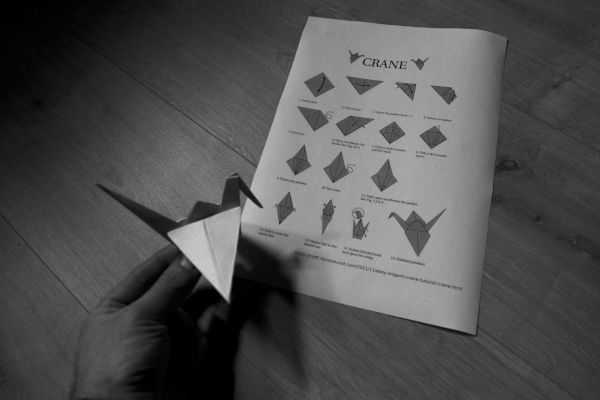

alias:: algorithms, algoritme, algoritmen
tags:: semester2

- **TL,DR**
    - Een algoritme is een set van (goede) instructies, bv. een stappenplan van de taken van een computerprogramma.
-
- **Motivering**
    - {:width 512}
    - Wanneer je aan je reis begint om te leren programmeren, ben je vooral bezig met het leren van de  ̇ [[syntaxis]] van een nieuwe programmeertaal.
    - Maar zodra je beter vertrouwd raakt met de taal, verschuift de focus van uw problemen meer en meer naar de feitelijke inhoud van het programma: een set van instructies die nodig zijn om een probleem op te lossen.
    - Deze instructies noemen we een **"algoritme"**. Een algoritme kan los staan van de programmeertaal (we schrijven een stappenplan in "mensentaal"), en hij is ofwel specifiek voor een eenmalig probleem, of generaliseerbaar tot andere situaties.
    - Een voorbeeld van een algoritme zijn vouwinstructies voor origami. Het doel is het aanmaken van een figuur. De stappen kunnen op de één of andere manier (bv. pictogramma's) van één persoon naar een andere overdragen worden; ze moeten duidelijk, volledig, en daarmee reproduceerbaar zijn.
    - Noot: het voorbeeld van de [pannenkoeken in het hoofdstuk over "control flow"](control flow) is ook een typische algoritme.
-
- **Definitie**
    - Een algoritme in de informaticawetenschappen is een *gedefinieerd* reeks van *ondubbelzinnige* computer-instructies die *implementeerbaar* zijn.
    - *Gedefinieerd:* er is een specifieke reeks stappen die een taak uitvoert.
    - *Ondubbelzinnig:* er is een ‘juiste’ en ‘onjuiste’ interpretatie van de stappen, het is duidelijk dat we de 'juiste' kiezen.
    - *Implementeerbaar:* het kan worden geïmplementeerd in code of met behulp van hardware; dit houdt bv. in dat de reeks eindig (= niet oneindig) is, en dat de [[complexiteit]] beperkt is.
-
- zie ook [hier](https://nl.wikipedia.org/wiki/Algoritme)