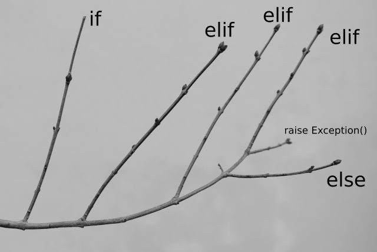

alias:: conditional, voorwaarden

- {:width 400}
- **TL;DR**
	- Met een conditional kan je de [[flow]] vertakken of splitsen, afhankelijk van een voorwaarde.
	- Voorwaardes zijn [[boolean]].
	- In python gebruiken we `if ... else ...`, maar andere constructies zijn mogelijk.
-
- **Motivatie**
	- Terug naar onze [pannenkoeken](control flow): stel dat sommige mensen een voorkeur hebben voor pannenkoeken met kaas, en anderen geven de voorkeur aan pindakaas. Of honing. Of stroop. Alles lekker!
	- Het grondrecept blijft hetzelfde, maar je kan de topping aanpassen.
-
- **Syntaxis**
	- een voorbeeld voor de [[syntaxis]]:
	  ```python
	  def Topping(pannenkoek, ingredient):
	  	pannenkoek.AddTopping(ingredient)
	      return
	      
	  pannenkoek = PannenkoekBakken() # we hebben al een pannenkoek
	  if keuze == 'zoet':
	      Topping(pannenkoek, 'bloemsuiker')
	  elif keuze == 'kaas': 
	  	Topping(pannenkoek, 'kaas')
	  else:
	  	Topping(pannenkoek, None)
	      
	  ```
	- Noot dat we hier `if`, `elif` en `else` achter elkaar gebruiken ('als', 'anders-als' en 'anders'). Het woordje `elif` staat voor 'else if' en vraagt ook een boolean, terwijl `else` alles opvangt wat overblijft.
	- `elif` en `else` zijn optioneel, je kan dus perfect een `if`-conditional met alleen maar één `if` opbouwen.
	- Je kan meerdere `elif`s stapelen, maar de regels voor [[flow]] zijn ook hier geldig: de computer bekijkt de voorwaarden van boven naar beneden.
-
- **Meerdere Keuzes: "Switch" = Dicts** (voor gevoorderden)
	- In sommige andere programmeertalen bestaat er een "switch" statement voor bijzonder lange reeksen van `if... elif...`.
	- In python is dit niet nodig. Je kan elke `if...elif...` vervangen door een [[dictionary]] met de twee uitkomsten.
	- Meestal is het handig dat je binnen een dict ook functies kan opslaan.
	- Voorbeeld:
	  ```python
	  Keuzes = { 'zoet': lambda pannenkoek: Topping(pannenkoek, 'bloemsuiker') \
	           , 'kaas': lambda pannenkoek: Topping(pannenkoek, 'kaas') \
	           , 'nutella': lambda pannenkoek: Topping(pannenkoek, 'nutella') \
	           , 'banaan': lambda pannenkoek: Topping(pannenkoek, 'banaan') \
	           , 'oorsmeer': lambda pannenkoek: raise IOError('Dit gaan we niet doen.') \
	           }
	  
	  # en toepassen:
	  Keuzes.get('zoet', lambda pk: Topping(pk, None))(pannenkoek)
	  ```
	- WAARSCHUWING: dit voorbeeld gebruikt [[anonymous functions]], de functie `dict.get()` van [[dict]]s en twee haakjes achter elkaar (aaneenschakeling van functie-uitkomsten). Dit is iets voor gevoorderden; wanhoop niet als dit niet ineens/nog niet duidelijk is!
	-
- **Typische Fouten**
	- Met afstand de meeste fouten met conditionals gebeuren door een foutieve voorwaarde. Om te zien of je boolean correkt zit, print hem gewoon eventjes af voordat of nadat je in de conditional gaat.
	  ```python
	  print (keuze, keuze == 'zoet')
	  if keuze == 'zoet':
	      print ('keuze was zoet!')
	      Topping(pannenkoek, 'bloemsuiker')
	  ```