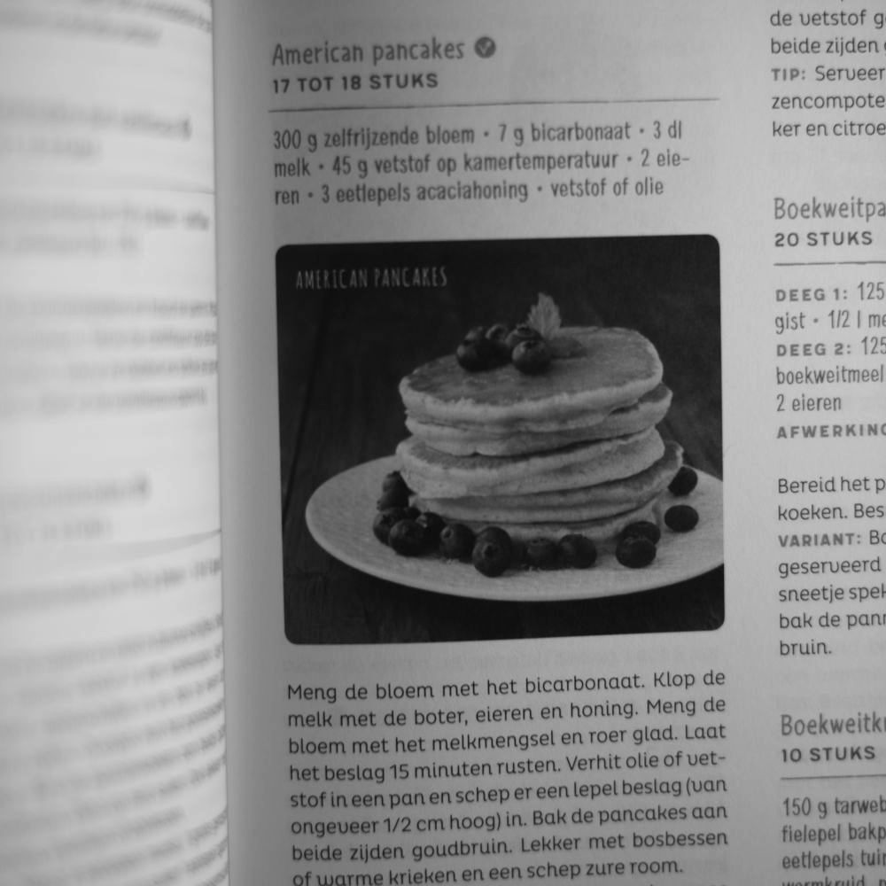

alias:: flow, controlestroom

- **TL;DR**
	- De computer verwerkt een programma van boven naar beneden, van binnen haakjes naar buiten, en van links naar rechts. Dit noemen we de "flow".
	- Er zijn uitzonderingen, bv.: [[lussen]], [[voorwaarden]] , [[functies]] en [[klassen]]. Met deze kan je de "flow" controleren, we spreken dan van control flow.
-
- **Motivering: Pannekoeken**
	- {:width 400}
	- Je wilt pannekoeken eten, en volgt het recept vanuit een kookboek (hier: "Koken voor elke dag", Manteau, 2016).
		- Meng de bloem met het bicarbonaat.
		- Klop de melk met de boter, eieren en honing.
		- Meng de bloem met het melkmengsel en roer glad.
		- Laat het beslag 15 minuten rusten.
		- ...
	- Dit is een recept. Er horen ingredienten bij (die zou je als [[variabelen]] kunnen beschouwen). En er zit een **stappenplan**, een lijst met dingen die je moet doen om pannenkoeken te krijgen.
	- Als je die stappenplan volgt, van boven naar beneden, dan krijg je lekker eten.
	- Noot dat sommige werkwoorden in de lijst [[functions]] zijn die er niet verder uitgelegd staan; bijvoorbeeld "*klop de melk met boter, eieren en honing*" zou iets raars kunnen zijn om te doen, als je niet weet wat "kloppen" in die context betekent.
	- En je moet de stappen in de juiste volgorde uitvoeren: als je nog geen melkmengsel hebt, kan je het niet mengen; als je alles eerst laat rusten en dan mengt, zou er wel een pannenkoeken uit komen, maar misschien minder lekker.
	- Een recept voor pannenkoeken is trouwens een voorbeeld van een [[algoritme]].
-
- **Flow**
	- Dit is precies wat de computer doet zodra hij een programma krijgt.
	- ```python 
	  a = 1
	  b = 1
	  c = a * (b + a)
	  print ("Het resultaat is: c = ", c)
	  ```
	- In dit voorbeeld defineren we twee [[variabelen]], `a` en `b`, en wijzen hen de waarde `1` ("één") toe. Dan defineren we de variable `c` en wijzen de waarde `a*(b+a)` toe. Het resultaat printen we af.
	- De computer zou niet kunnen afprinten zonder `c` te kennen. Ook de som van `a` en `b` kan je pas berekenen nadat je die variabelen gedefineerd heeft. Anders geeft de computer een [[foutmelding]].
	- De volgende drie algemene kenmerken van de Flow van een script of programma zijn belangrijk, in die volgorde:
		- Verwerken **van boven naar beneden**.
		- Verwerken **van binnen de haakjes** naar buiten.
		- Verwerken **van links naar rechts**.
	- Er zijn uitzonderingen, waar de computer een commando niet direct uitvoerd, of een commando herhaald uitvoerd. Dit noemen we dan "control flow".
-
- **Control Flow**
	- Wij gaan hier beginnen met twee manieren om de uitvoeringsvolgorde van een programma aan te passen: loops (lusjes) en conditionals (voorwaarden).
		- [[loops]]
		- [[conditionals]]
	- Later gaan we ook nog zien hoe we een programma in [[functions]] en [[classes]] structureren.
	- "parallel computing" is het "tegelijkertijd" uitvoeren van programmadelen; voor sommige toepassingen is dit enorm handig.
-
- **Onthouden**
	- Control Flow is de verkeersorganisatie van jouw programma! Let er goed op mee, en "let it flow!"
	- {:width 400} 
	  Photo by <a href="https://unsplash.com/@chuttersnap?utm_content=creditCopyText&utm_medium=referral&utm_source=unsplash">CHUTTERSNAP</a> on <a href="https://unsplash.com/photos/aerial-view-of-cars-passing-on-road-near-buildings-GH5ZA-8adZs?utm_content=creditCopyText&utm_medium=referral&utm_source=unsplash">Unsplash</a>
-