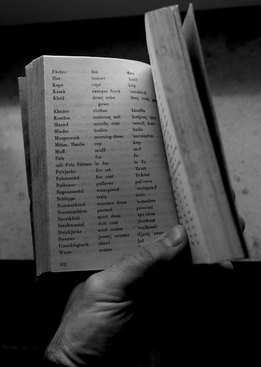

alias:: dictionary, dictionaries, dict, dicts, woordenboeken, woordenboek

- {:width 256}
- Een `dict` / **dictionary** is een geordende* versameling van paren van sleutels en waarden. Zoals een woordenboek.
  (* in oudere python-versies was de volgorde in een `dict` nog toevallig.)
- Je kan een dict aanmaken met de functie `dict(sleutel = waarde, key = value)` of door gekrulde haakjes:
  ```python
  telefoonnummers = { \
                    "Max": "0123 457890" \
                    , "Birgitte": "0987 6543210" \
                    }
  ```
  Characteristisch is dat je de `key`/`value`-paren niet met een `=` verbindt, maar met een dubbele punt (`:`).
- In een [[iteratie]] kan je de functies `mijn_dict.keys()`, `mijn_dict.values()` en `mijn_dict.items()` gebruiken. Voorbeeld:
  ```python
  for naam, nummer in telefoonnummers.items():
      print(f"De nummer van {naam} is {nummer}.")
  ```
- Andere functies:
  ```python
  telefoonnummers.get("John", "geen nummer gevonden!") # geeft een waarde indien element niet in dict
  
  ```