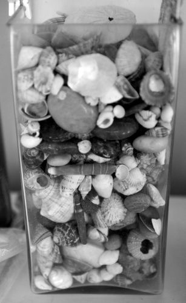

alias:: set

- {:width 200}
- Een **set** is een ongeordende collectie van unieke variabelen.
- Je kan een set aanmaken met gekrulde haakjes `{}` of met de functie `set()`.
- Een goede manier om een lijst met unieke inhoud te krijgen is de conversie tot een `set`:
  ```python
  lijst = [1, 1, 2, 4, 4, 4, 5, 6, 8, 8]
  unieke = list(set(lijst)) # [1, 2, 4, 5, 6, 8]
  ```
- Sets werken zo als [versamelingen](https://nl.wikipedia.org/wiki/Verzameling_(wiskunde)) in de wiskunde: je kan heel goed bv. de vereniging of doorsnede van twee sets vinden.
- Sets gebruiken hiervoor ["operator overloading"](OOP), je kan dus goed werken met `+`, `-`, `/` enz.