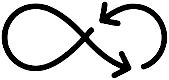
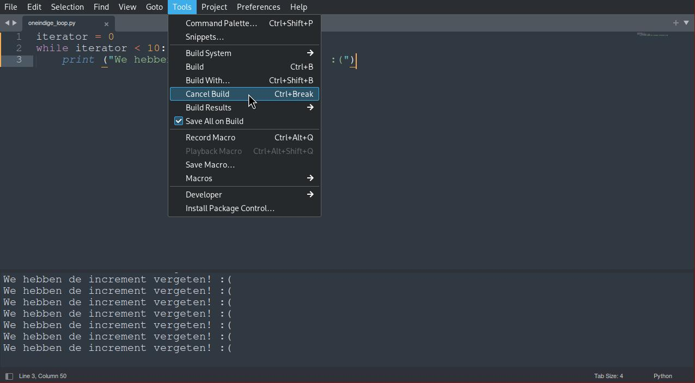

alias:: lussen, lus, loops, iteratie, iteration

- 
-
- **TL;DR**
	- We gebruiken twee soorten loops in python: `for ... in ...:` en `while ...:`
	- Elke loop heeft drie dingen nodig: een iterator met begin-conditie, een increment, en een stop-conditie.
	- Pas op met "infinite loops".
-
- **Motivering**
	- Terug naar het pannekoeken-voorbeeld van [[control flow]]: je hebt er deeg aangemaakt en wilt de pannenkoeken nu in de pan zetten. Wat is aan de volgende instructies niet goed?
		- **0e pannenkoek:**
		- verhit olie of vetstof
		- schep er een lepel beslag in
		- bak pancake van de eerste zij
		- draai de pannenkoek
		- bak de tweede zij
		- warm serveren
		-
		- **1e pannenkoek:**
		- verhit olie of vetstof
		- schep er een lepel beslag in
		- bak pancake van de eerste zij
		- draai de pannenkoek
		- bak de tweede zij
		- warm serveren
		-
		- **2de pannenkoek:**
		- verhit olie of vetstof
		- schep er een lepel beslag in
		- bak pancake van de eerste zij
		- draai de pannenkoek
		- bak de tweede zij
		- warm serveren
		-
		- **3e pannenkoek:**
		- [...]
		-
	- Je ziet duidelijk: dit is heel veel tekst voor drie pannenkoeken. Het wordt heel lastig als je een grote hoeveelheid pannenkoeken wilt bakken, en stel je voor dat je dan een schrijffout in de instructies vindt om aan te passen!
	- Je ziet ook: het lukt wel! Je zou op die manieren kookboeken kunnen schrijven. Alleen is het niet handig.
-
- **Ingredienten**
	- Als we herhaalde stukjes programmacode zien, ookal zijn die soms lichtjes gewijzigd, dan is het meestal beter om de code in een *loop* te formuleren (engels: "loop", voor lus).
	- Boven valt op dat niet duidelijk is wanneer je stopt met pannenkoeken bakken. Elke lus heeft een duidelijke **stop-conditie** nodig.
	- De pannenkoeken zijn wel genummerd, met een gewone volgnummer of teller (0e, 1e, 2de, 3e...). In het algemeen noemen we dit een **iterator**, we itereren bij een iteratie over een aantal elementen. Het is hier heel duidelijk om met de eerste pannenkoek te beginnen. In python zou die uiteraard de volgnummer nul hebben (0e pannenkoek). We noemen dit een **begin-conditie**, de computer moet weten waar hij moet beginnen.
	- Ten slot moeten we van begin naar einde geraken, en daarvoor bijvoorbeeld de volgnummer omhoog tellen. We noemen dit een **increment**. Zonder increment lopen we op de plek en de loop gaat eindeloos vooruit.
	-
- **While-loops**
	- We gaan nu onze pannenkoeken-bak-robot programmeren, met een `while`-loop.
	- ```
	  beslaghoeveelheid = 10 # lepels
	  while beslaghoeveelheid > 0:
	  	Verhit_Olie()
	      
	      pannenkoek = Schep_Lepel()
	      beslaghoeveelheid -= 1
	      
	      Bak_GedurendeMinuten(pannenkoek, 2)
	      Draai(pannenkoek)
	      Bak_GedurendeMinuten(pannenkoek, 2)
	      
	      Opeten(pannenkoek)
	      
	  Opruimen()
	  ```
	-
	- Vindt jij erin de iterator, de begin- en stop-conditie, en het increment terug?
	- Let goed op de [[syntaxis]] van dit stukje code:
		- het blokje begint met `while <conditie>:`; de conditie moet een [[boolean]] of waarheidswaarde uitgeven.
		- de "increment" is hier een "decrement": we gaan aftellen zolang er nog lepels beslag in de kom zitten.
		- De beginsituatie en het increment zitten er niet mee in de lijn met `while`, maar zijn apart gedefineerd.
		- Zoals altijd in python is de [[inschuiving]] belangrijk voor de computer om te weten waar een blok code eindigd. Noot: de *lus* eindigd als het beslag op is. De code eindigt naar lijn 12: `Opeten()` (maar die blok wordt herhaald).
	-
- **For-loops**
	- Stel dat je het beslag niet in één grote kom hebt, maar al netjes voorbereidt in hoeveelheiden voor telkens één pannenkoek. Muffin-voormpjes met pannenkoek-beslag, bijvoorbeeld.
	- Je zou dan de loop op de volgende manier kunnen toepassen:
	- ```
	  def Bakken(pannenkoek):
	  	Bak_GedurendeMinuten(pannenkoek, 2)
	      Draai(pannenkoek)
	      Bak_GedurendeMinuten(pannenkoek, 2)
	  
	  beslagreeks = [1, 1, 1, 1, 1, 1, 1, 1, 1, 1]
	  for beslag in beslagreeks:
	  	Verhit_Olie()
	      
	      pannenkoek = Schep(beslag)
	      
	  	Bakken(pannenkoek)
	      Opeten(pannenkoek)
	  Opruimen()
	  ```
	- Vindt jij hier opnieuw de iterator, de begin- en stop-conditie, en het increment terug?
	- Opnieuw de [[syntaxis]]:
		- Een reeks van data is vooraf aangemaakt, hier een lijst met tien keer de nummer `1`.
		- De lus begint met het signaalwoord `for ... in ...:`.
		- Een increment is hier impliciet: de lus gaat gewoon over alle elementen binnen die reeks itereren.
		- Daarom zijn ook de begin- en stop-conditie niet zichtbaar: de lus gaat met het eerste element beginnen, en stoppen als de lijst op is.
	- Je zou dus kunnen zeggen dat de `for`-lus in python wat veiliger is, want de kans dat je een oneindige lus oploopt is kleiner. Andererzijds moet je een goede iterator voorbereiden.
-
- **Loop Control**
	- Je kan er de [[control flow]] binnen een loop verder controleren met de volgende signaalwoorden:
		- `continue`: springt naar de volgende iteratie
		- `break`: breekt de lus af
	-
- **Typische Fouten**
	- Als je de stop-conditie niet zet of het increment vergeet, kom je soms in een **oneindige lus** terecht. Je computer gaat dan voor alle tijden met die berekening bezig blijven.
	- 
	-