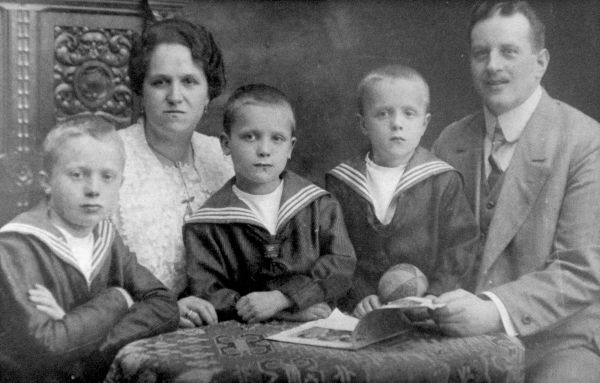

alias:: OOP, object-oriented, objectgeoriënteerd programmeren
tags:: uitbreiding

- OOP is een programmeerstijl die de focus legt op het aanmaken van eigen datatypes, of [[klassen]].
- Motivering: zie [[datatypen]]
- Je begint een eigen class met het signaalwoord `class`.
  ```python
  class Robot:
      # de klasdefinitie
      def __init__(self, naam):
          self.naam = naam
  
      variabele = 10 # klasvariabele
      
      def functie(self): # klasfunctie
          print("de robot doet iets...", self.variabele, "keer.")
  
  wall_e = Robot("Wall-E") # roept de Robot.__init__() -functie op.
  wall_e.functie()
  ```
- De klasdefinitie is eigenlijk een blauwdruk van wat een object alles nodig heeft. Later, als je een instantie van de klas aanmakt (lijn 11 boven), wordt de functie `<Robot>.__init__()` uitgevoerd en een concrete robot aangemaakt.
- Een klas heeft klasvariabelen ([[variabelen]]) en klasmethodes ([[functies]]), die binnen de klas uitgevoerd worden. Je vindt deze terug met een punt (`.`): binnen de klasomgeving met `self.variabele` of `self.functie()`, buiten de klasomgeving met `wall_e.variabele` of `wall_e.functie()`.
- klasvariabelen zijn in python niet gebruikelijk en te vermijden.
- Binnen klasmethodes helpt de variabele `self` (telkens het eerste [[argument]] van een klasfunctie) om op de eigenschappen van een specifieke instantie van een object te kunnen toegrijpen.
-
- **Concepten**
	- Met Objectorientering komen heel veel concepten die in de programmering enorm nuttig zijn, onder meer:
		- **inheritance**
		- **encapsulation**
		- **abstraction**
		- **interfaces**
		- **polymorphism**
		- **(operator) overloading**
	- dit zijn concepten voor gevorderden buiten het kader van onze cursus. Maar laat je daarvan niet afschrikken!
	- {:width 256} *(inheritance)*
-
- OOP en [FP](functional programming) zijn complementair, je mag ze allebei gebruiken!